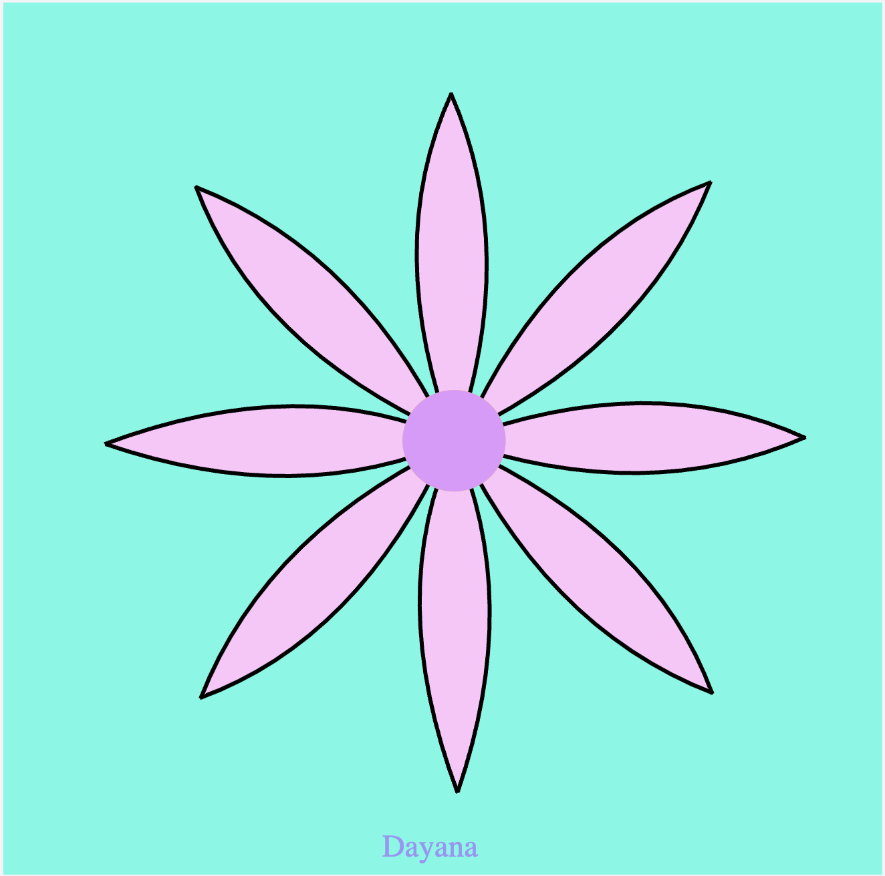
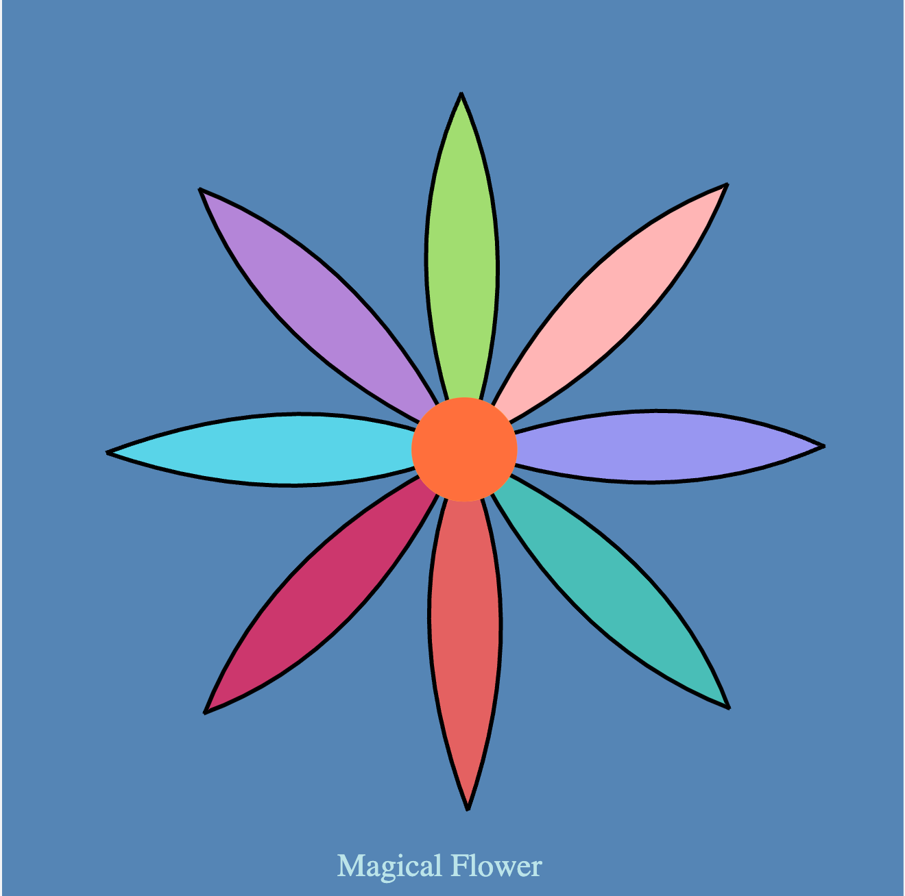
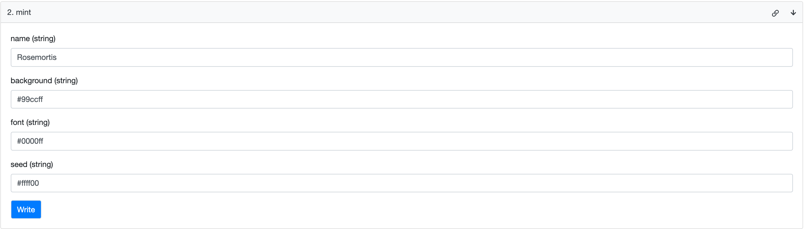
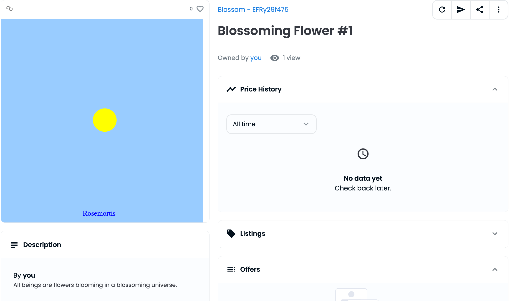
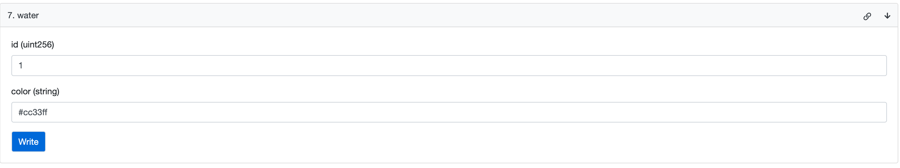
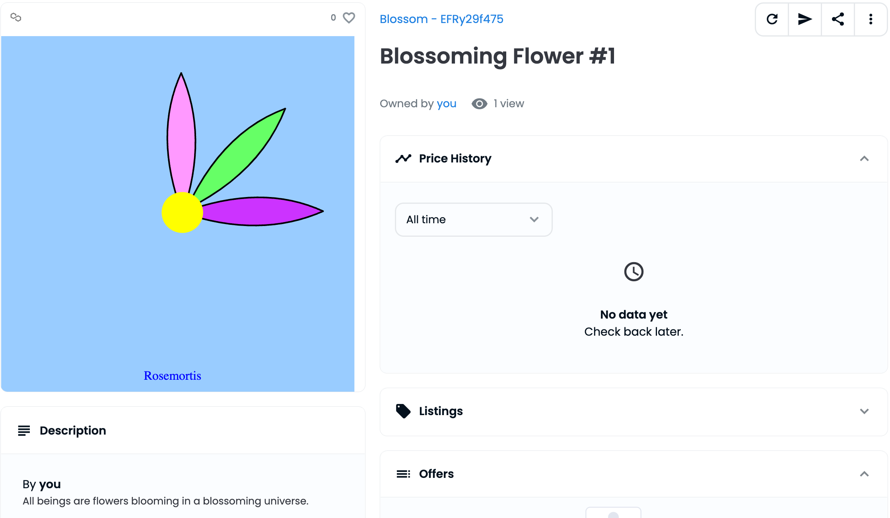
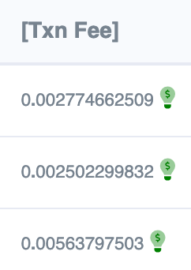

# Blossoming Flower NFT - A Customizable Dynamic NFT
* Week 3 of Alchemy's Road To Web3 Challenge [link](https://docs.alchemy.com/docs/3-how-to-make-nfts-with-on-chain-metadata-hardhat-and-javascript)
* Make NFTs with On-Chain Metadata that we can update
* Process and store on-chain SVG images and JSON objects
* Modifying the metadata to modify the image's SVG Attributes & update the NFT's image
* Encode SVG Image to a Base64 String.
### Chose Your Colors Here
* [Color Palettes](https://palettes.shecodes.io/)
* [Color Picker](https://www.w3schools.com/colors/colors_picker.asp)

### Mint Your Blossoming Flower NFT
* Minting Inputs:
  * Name of your flower (ex: Your name...)
    * [name generator](https://www.fantasynamegenerators.com/magic-types.php)
    * [name generator 2](https://www.fantasynamegenerators.com/mutant-plant-names.php)
  * Background Color (CSS Hex Input, ex: "#8ef6e4")
  * Font Color of your flower's name (CSS Hex Input, ex: "#9896f1")
  * Seed Color (CSS Hex Input, ex: "#9896f1")

Example Mint Call: 
```
let txn = await contract.mint("Dayana", "#8ef6e4", "#9896f1", "#9896f1");
```

### Water Your Flower
* Watering Inputs
  * Provide your flower's token ID (ex: 1)
  * Provide color for new petal (CSS Hex Input, ex: "#f5c7f7")
  * You can only water your flower 8 times for it to complete.

Example Water Call:
```
txn = await contract.water(1, "#f5c7f7");
```
### Example Output of Completed Flowers: 






### Quick Start 
* First, Fork & Clone Repository
```shell
yarn compile
yarn deploy
yarn test
yarn color
```
### Debugging Tips
* To test how your svg image is looking like without deploying to testnet & inspecting opensea eachtime (Been there, done that) I recommend:
  * Use this editor to paste your image's Base64 in the src of the img tag: https://www.w3docs.com/tools/code-editor/10848
  * How do you get the base64 image? 
    * console.log() it in your solidity code
  * How do you console.log() in Solidity?
    * Add `import "hardhat/console.sol";` to your file
    * Make sure you're running your script on `--network hardhat`

* Example of pasting the base64 img into the editor above:
```html
<!DOCTYPE html>
<html>
  <head>
  </head>
  <body>
    <div>
      <img src="data:image/svg+xml;base64,PHN2ZyB2aWV3Qm94PSIxMyAtNCA0NjEgNDU1IiB4bWxucz0iaHR0cDovL3d3dy53My5vcmcvMjAwMC9zdmciIHhtbG5zOmJ4PSJodHRwczovL3d3dy5ib3h5LXN2Zy5jb20vYngiPjxyZWN0IHdpZHRoPScxMDAlJyBoZWlnaHQ9JzEwMCUnIGZpbGw9JyM1NTg1YjUnLz48ZyB0cmFuc2Zvcm09J21hdHJpeCgwLjY3ODU3MSwgMCwgMCwgMC43MTczMjYsIDEyMS4wMDk1NTIsIC0yNC4xMDYwNjgpJz48cGF0aCBkPSdNIDE3Ny42MiA5OC4wMDIgQyAxNDEuODExIDE3MC44OSAxNDIuNTczIDI1NC40NDQgMTc5LjkwNiAzNDguNjY1JyBzdHlsZT0nc3Ryb2tlOiBub25lOyBmaWxsOiNhMWRkNzA7c3Ryb2tlLXdpZHRoOjM7c3Ryb2tlOmJsYWNrJy8+PHBhdGggZD0nTSAxNzYuODU4IDk4LjAwMiBDIDIxMS45MDUgMTczLjE3NSAyMTIuOTIxIDI1Ni40NzYgMTc5LjkwNiAzNDcuOTAzJyBzdHlsZT0nc3Ryb2tlOiBub25lOyBmaWxsOiNhMWRkNzA7c3Ryb2tlLXdpZHRoOjM7c3Ryb2tlOmJsYWNrJy8+PC9nPjxnIHRyYW5zZm9ybT0nbWF0cml4KDAuNDc5ODIyLCAwLjQ3OTgyMiwgLTAuNTA3MjI2LCAwLjUwNzIyNiwgMzM4LjM2NjAyOCwgLTQzLjI0MDQ0NCknPjxwYXRoIGQ9J00gMTc3LjYyIDk4LjAwMiBDIDE0MS44MTEgMTcwLjg5IDE0Mi41NzMgMjU0LjQ0NCAxNzkuOTA2IDM0OC42NjUnIHN0eWxlPSdzdHJva2U6IG5vbmU7IGZpbGw6I2ZmYjViNTtzdHJva2Utd2lkdGg6MztzdHJva2U6YmxhY2snLz48cGF0aCBkPSdNIDE3Ni44NTggOTguMDAyIEMgMjExLjkwNSAxNzMuMTc1IDIxMi45MjEgMjU2LjQ3NiAxNzkuOTA2IDM0Ny45MDMnIHN0eWxlPSdzdHJva2U6IG5vbmU7IGZpbGw6I2ZmYjViNTtzdHJva2Utd2lkdGg6MztzdHJva2U6YmxhY2snLz48L2c+PGcgdHJhbnNmb3JtPSdtYXRyaXgoMCwgMC42Nzg1NzEsIC0wLjcxNzMyNiwgMCwgNDkyLjIzMzE4NSwgMTAxLjgzNTM2NSknPjxwYXRoIGQ9J00gMTc3LjYyIDk4LjAwMiBDIDE0MS44MTEgMTcwLjg5IDE0Mi41NzMgMjU0LjQ0NCAxNzkuOTA2IDM0OC42NjUnIHN0eWxlPSdzdHJva2U6IG5vbmU7IGZpbGw6Izk4OTZmMTtzdHJva2Utd2lkdGg6MztzdHJva2U6YmxhY2snLz48cGF0aCBkPSdNIDE3Ni44NTggOTguMDAyIEMgMjExLjkwNSAxNzMuMTc1IDIxMi45MjEgMjU2LjQ3NiAxNzkuOTA2IDM0Ny45MDMnIHN0eWxlPSdzdHJva2U6IG5vbmU7IGZpbGw6Izk4OTZmMTtzdHJva2Utd2lkdGg6MztzdHJva2U6YmxhY2snLz48L2c+PGcgdHJhbnNmb3JtPSdtYXRyaXgoLTAuNDc5ODIyLCAwLjQ3OTgyMiwgLTAuNTA3MjI2LCAtMC41MDcyMjYsIDUwOS4zMzYxMjEsIDMxNy40MTM5NCknPjxwYXRoIGQ9J00gMTc3LjYyIDk4LjAwMiBDIDE0MS44MTEgMTcwLjg5IDE0Mi41NzMgMjU0LjQ0NCAxNzkuOTA2IDM0OC42NjUnIHN0eWxlPSdzdHJva2U6IG5vbmU7IGZpbGw6IzQ5YmViNztzdHJva2Utd2lkdGg6MztzdHJva2U6YmxhY2snLz48cGF0aCBkPSdNIDE3Ni44NTggOTguMDAyIEMgMjExLjkwNSAxNzMuMTc1IDIxMi45MjEgMjU2LjQ3NiAxNzkuOTA2IDM0Ny45MDMnIHN0eWxlPSdzdHJva2U6IG5vbmU7IGZpbGw6IzQ5YmViNztzdHJva2Utd2lkdGg6MztzdHJva2U6YmxhY2snLz48L2c+PGcgdHJhbnNmb3JtPSdtYXRyaXgoMC42Nzg1NzEsIDAsIDAsIDAuNzE3MzI2LCAxMjIuNTMzMzQsIDE1My40MTUwMjQpJz48cGF0aCBkPSdNIDE3Ny42MiA5OC4wMDIgQyAxNDEuODExIDE3MC44OSAxNDIuNTczIDI1NC40NDQgMTc5LjkwNiAzNDguNjY1JyBzdHlsZT0nc3Ryb2tlOiBub25lOyBmaWxsOiNlNDYxNjE7c3Ryb2tlLXdpZHRoOjM7c3Ryb2tlOmJsYWNrJy8+PHBhdGggZD0nTSAxNzYuODU4IDk4LjAwMiBDIDIxMS45MDUgMTczLjE3NSAyMTIuOTIxIDI1Ni40NzYgMTc5LjkwNiAzNDcuOTAzJyBzdHlsZT0nc3Ryb2tlOiBub25lOyBmaWxsOiNlNDYxNjE7c3Ryb2tlLXdpZHRoOjM7c3Ryb2tlOmJsYWNrJy8+PC9nPjxnIHRyYW5zZm9ybT0nbWF0cml4KC0wLjQ3OTgyMiwgLTAuNDc5ODIyLCAwLjUwNzIyNiwgLTAuNTA3MjI2LCAxNDguNjgxODU0LCA0ODkuOTA3ODA2KSc+PHBhdGggZD0nTSAxNzcuNjIgOTguMDAyIEMgMTQxLjgxMSAxNzAuODkgMTQyLjU3MyAyNTQuNDQ0IDE3OS45MDYgMzQ4LjY2NScgc3R5bGU9J3N0cm9rZTogbm9uZTsgZmlsbDojY2MzNzZkO3N0cm9rZS13aWR0aDozO3N0cm9rZTpibGFjaycvPjxwYXRoIGQ9J00gMTc2Ljg1OCA5OC4wMDIgQyAyMTEuOTA1IDE3My4xNzUgMjEyLjkyMSAyNTYuNDc2IDE3OS45MDYgMzQ3LjkwMycgc3R5bGU9J3N0cm9rZTogbm9uZTsgZmlsbDojY2MzNzZkO3N0cm9rZS13aWR0aDozO3N0cm9rZTpibGFjaycvPjwvZz48ZyB0cmFuc2Zvcm09J21hdHJpeCgwLCAwLjY3ODU3MSwgLTAuNzE3MzI2LCAwLCAzMTQuNzEyMDk3LCAxMDMuMzU5MTQ2KSc+PHBhdGggZD0nTSAxNzcuNjIgOTguMDAyIEMgMTQxLjgxMSAxNzAuODkgMTQyLjU3MyAyNTQuNDQ0IDE3OS45MDYgMzQ4LjY2NScgc3R5bGU9J3N0cm9rZTogbm9uZTsgZmlsbDojNTlkNGU4O3N0cm9rZS13aWR0aDozO3N0cm9rZTpibGFjaycvPjxwYXRoIGQ9J00gMTc2Ljg1OCA5OC4wMDIgQyAyMTEuOTA1IDE3My4xNzUgMjEyLjkyMSAyNTYuNDc2IDE3OS45MDYgMzQ3LjkwMycgc3R5bGU9J3N0cm9rZTogbm9uZTsgZmlsbDojNTlkNGU4O3N0cm9rZS13aWR0aDozO3N0cm9rZTpibGFjaycvPjwvZz48ZyB0cmFuc2Zvcm09J21hdHJpeCgwLjQ3OTgyMiwgLTAuNDc5ODIyLCAwLjUwNzIyNiwgMC41MDcyMjYsIC0yMy44MTIxMTEsIDEyOS4yNTM0MzMpJz48cGF0aCBkPSdNIDE3Ny42MiA5OC4wMDIgQyAxNDEuODExIDE3MC44OSAxNDIuNTczIDI1NC40NDQgMTc5LjkwNiAzNDguNjY1JyBzdHlsZT0nc3Ryb2tlOiBub25lOyBmaWxsOiNiNDg1ZDg7c3Ryb2tlLXdpZHRoOjM7c3Ryb2tlOmJsYWNrJy8+PHBhdGggZD0nTSAxNzYuODU4IDk4LjAwMiBDIDIxMS45MDUgMTczLjE3NSAyMTIuOTIxIDI1Ni40NzYgMTc5LjkwNiAzNDcuOTAzJyBzdHlsZT0nc3Ryb2tlOiBub25lOyBmaWxsOiNiNDg1ZDg7c3Ryb2tlLXdpZHRoOjM7c3Ryb2tlOmJsYWNrJy8+PC9nPjxlbGxpcHNlIHN0eWxlPSJmaWxsOiNmZmM5M2M7IiBjeD0iMjQyLjc2NyIgY3k9IjIyMy43MTMiIHJ4PSIyNi4yODUiIHJ5PSIyNS45MDQiLz48ZWxsaXBzZSBzdHlsZT0nZmlsbDojZmY2ZjNjOycgY3g9JzI0Mi43NjcnIGN5PScyMjMuNzEzJyByeD0nMjYuMjg1JyByeT0nMjUuOTA0Jy8+PHRleHQgeD0nNTAlJyB5PSc5NSUnIGZpbGw9JyNiYmU0ZTknIGRvbWluYW50LWJhc2VsaW5lPSdtaWRkbGUnIHRleHQtYW5jaG9yPSdtaWRkbGUnPk1hZ2ljYWwgRmxvd2VyPC90ZXh0Pjwvc3ZnPg=="/>
    </div>
  </body>
</html>
```

Solidity - console.log(base64img):
```javascript
    function generateFlower(uint256 id) internal returns(string memory){
        FlowerStats memory data = idToFlowerStats[id];
        bytes memory svg = abi.encodePacked(
            '<svg viewBox="13 -4 461 455" xmlns="http://www.w3.org/2000/svg" xmlns:bx="https://www.boxy-svg.com/bx">',
            string(abi.encodePacked("<rect width='100%' height='100%' fill='", data.background,"'/>")),
            getPetals(id),
            '<ellipse style="fill:#ffc93c;" cx="242.767" cy="223.713" rx="26.285" ry="25.904"/>',
            string(abi.encodePacked("<ellipse style='fill:", data.seed,";' cx='242.767' cy='223.713' rx='26.285' ry='25.904'/>")),
            string(abi.encodePacked("<text x='50%' y='95%' fill='", data.font, "' dominant-baseline='middle' text-anchor='middle'>")),
            data.name, 
            '</text>'
            '</svg>'
        );

        string memory base64img = 
              string(abi.encodePacked(
                "data:image/svg+xml;base64,",
                Base64.encode(svg))
              );

        if (data.level == 8) {
          console.log(base64img);
        }

        return uri;
    }    
```

### Testnet Walkthrough
* [Verified Contract](https://mumbai.polygonscan.com/address/0x12f21039d9ec8f7def4b2eb393212070f96ef95e)
* [View The Genesis NFT on OpenSea](https://testnets.opensea.io/assets/mumbai/0x12f21039d9ec8f7def4b2eb393212070f96ef95e/1)
* Mint:

* After Mint: 

* Water:

* After Watering 3 Times: 

* Transaction Fees:

